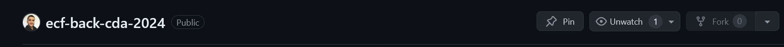
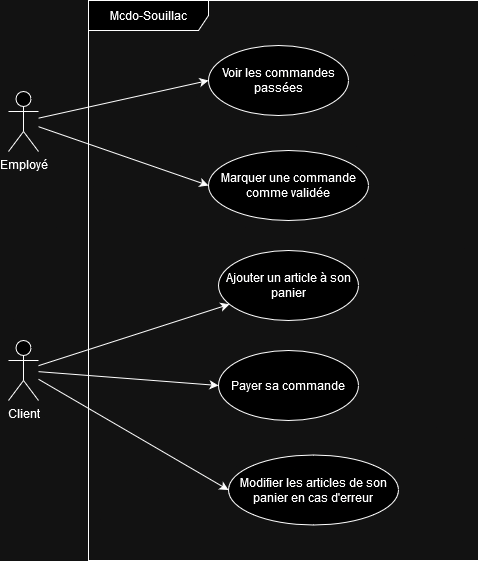
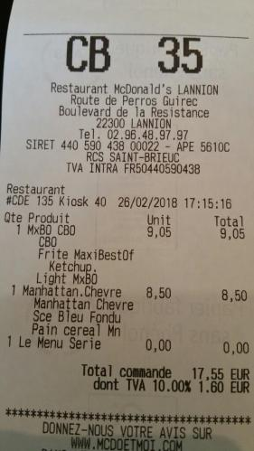

# ecf-back-cda-2024-server

Cette évalution est en deux parties : la première est une suite de questions la deuxième est un projet à coder.

# Modalités d'envoi du projet
Faite un fork de ce repository git et codez votre projet dans le dossier *app*.

*Voir **fork** en haut à droite*

## Partie 1 - Questions

1. Ecrire la requête SQL qui permet de récupérer tout les produits de la carte.
```sql
# Ecrivez la requête ici ...

```

2. Ecrire la requête SQL qui permet d'ajouter un produit au panier de l'utilisateur.
```sql
# Ecrivez la requête ici ...

```

3. Ecrire la requête SQL qui permet de valider une commande pour qu'elle parte en salle.
```sql
# Ecrivez la requête ici ...

```

4. Un nouveau burger est arrivé : le DoubleBigMassi. Ecrivez la requête SQL qui permet d'ajouter ce magnifique *burger* à la carte.
```sql
# Ecrivez la requête ici ...

```

5. Ecrire la requête SQL qui permet de récupérer tout les produits d'une commande en fonction de l'id d'un utilisateur.
```sql
# Ecrivez la requête ici ...

```

## Partie 2 - Projet
### Description du projet
Mettez en place le back-end du système de borne McDonalds de Souillac-les-bains.

- **Le back-end doit au minimum permettre un accès CRUD.**
- Le back-end doit être codé dans un langage fortement typé comme TypeScript, Java ou bien en PHP typé.
- Mcdo ne peut pas se permettre que le back-end plante à la moindre erreur. Mettez en place la gestion des erreurs qui empèche le back-end de planter.
- *Bonus : Sécurité les routes via un système d'authentification.*

Vous avez carte blanche sur la stack et le code tant que les consignes d'en haut sont réspectées.

### Documentations éventuelles
####  Use case


#### Exemple de  menu du Mcdo :
- [Table des prix](PRIX-.pdf)
- https://www.mcdonalds.com/ch/fr-ch/menu.html

#### Exemple de commande Mcdo :
Les commandes peuvent être mangées sur place ou à emportée.


